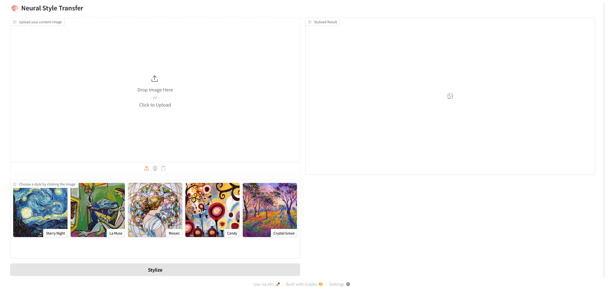
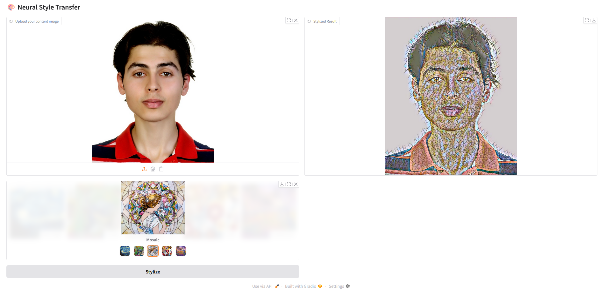

# 🎨 Feedforward Neural Style Transfer

Neural Style Transfer (NST) is a technique that blends the content of one image with the style of another, typically a famous artwork, to create a new artistic image. It leverages deep convolutional neural networks to extract and recombine high-level features from both images, capturing the texture, color, and patterns of the style image while preserving the content and structure of the input image.

<div align="center">
    
</div>


This project implements a **real-time** feedforward neural style transfer pipeline based on perceptual loss, inspired by the seminal work of Johnson et al. (2016). Instead of iteratively optimizing each output image, the model learns a fast mapping from content images to stylized images using a trained feedforward convolutional network, making it ideal for real-time applications.

The model transfers the style of a reference painting to arbitrary input images by optimizing a weighted combination of content and style losses computed on high-level features from a pre-trained VGG16 network.


---

## 🖼️ Stylization Results

Below are sample results from five different pre-trained models. Each image shows content images stylized with the corresponding style:

### 🎇 Starry Night
<div align="center">
  
</div>

### 🍬 Candy
<div align="center">
  
</div>

### 🧊 Crystal Grove
<div align="center">
  
</div>

### 🧩 Mosaic
<div align="center">
  
</div>

### 🧝‍♀️ La Muse
<div align="center">
  
</div>

---

## 🚀 Demo App

A Gradio web interface is under development, allowing users to upload content images and instantly stylize them using pre-trained models.

<div align="center">
  
  
</div>

---

## 📦 Installation

1. **Clone the repository**

```bash
git clone https://github.com/your-username/fast-neural-style-transfer.git
cd fast-neural-style-transfer
```

2. **Create and activate a Conda environment**
```bash
conda create -n nst python=3.9
conda activate nst
```

3. **Install dependencies**

```bash
pip install -e .[dev]
```

---

## 🧠 Model Architecture / Description 

<div align="center">
    
</div>


### 🏗️ Components

- **Transformer Network**
  - Input: RGB content image  
  - Architecture: Convolutional layers with instance normalization and ReLU activations  
  - Residual blocks (ResNet-style) at the core  
  - Upsampling via nearest-neighbor + convolution (to avoid checkerboard artifacts)

- **Perceptual Loss (VGG16-based)**
  - **Content loss**: Feature reconstruction loss at intermediate VGG16 layer (e.g., `relu2_2`)  
  - **Style loss**: Gram matrix loss at multiple VGG16 layers (e.g., `relu1_2`, `relu2_2`, `relu3_3`)  
  - **Total variation loss**: Optional regularizer to encourage spatial smoothness

---

## 🧪 Training Snapshots

Each model is trained to replicate the visual style of a single artwork using perceptual loss. The training progress was logged with TensorBoard, capturing:

- Loss curves: Content, Style, and Total Variation Loss
- Stylized image evolution throughout training

Below are the snapshots for each style model:

### 🎇 Starry Night
<div align="center">
  
</div>

### 🍬 Candy
<div align="center">
  
</div>

### 🧊 Crystal Grove
<div align="center">
  
</div>

### 🧩 Mosaic
<div align="center">
  
</div>

### 🧝‍♀️ La Muse
<div align="center">
  
</div>

The losses used during training were:

- **Content Loss**: Feature reconstruction loss from layer `relu2_2` of VGG16.
- **Style Loss**: Gram matrix loss across layers `relu1_2`, `relu2_2`, `relu3_3`.
- **Total Variation Loss**: Regularizer to enforce spatial smoothness and suppress noise.

The optimization objective was: `L_total = α * L_content + β * L_style + γ * L_TV`

---

### 🏋️ Training Details

- **Dataset**: MS-COCO (2014)  
- **Optimizer**: Adam  
- **Input size**: 256×256  
- **Batch size**: 4  
- **Training time**: ~1.5 hours on a single GPU  

Each model is trained to replicate the style of a single reference painting.

---

## 📜 References

- [Perceptual Losses for Real-Time Style Transfer and Super-Resolution (Johnson et al., 2016)](https://arxiv.org/abs/1603.08155)
- [Image Style Transfer Using Convolutional Neural Networks (Gatys et al., 2015)](https://arxiv.org/abs/1508.06576)

---

## ⚖️ License
This project is licensed under the MIT License - see the [LICENSE](LICENSE) file for details.