# 🎨 Feedforward Neural Style Transfer

Neural style transfer aims to generate an image that retains the semantic content of a photograph while adopting the visual appearance of an artwork.

<div align="center">
    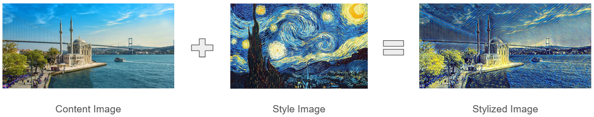
</div>

Traditional methods, such as the optimization-based approach introduced by Gatys et al. [1], rely on iterative updates during inference. While effective, these methods are computationally intensive and unsuitable for real-time applications. To address this limitation, feedforward networks trained with perceptual loss have been proposed, enabling style transfer in a single forward pass.

This project implements a fast neural style transfer pipeline based on the framework introduced by Johnson et al. [2], with minor modifications.

In the following sections, stylization results are presented first, followed by installation instructions and technical details. For an in-depth explanation, please see the [project report](report.pdf).

## 🖼️ Stylization Results

Below are sample outputs from five different pre-trained models. Each image showcases content images stylized with a specific artistic style:

### 🎇 Starry Night
<div align="center">
  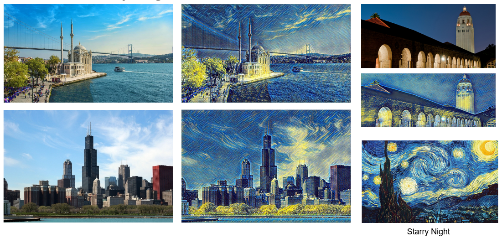
</div>

### 🍬 Candy
<div align="center">
  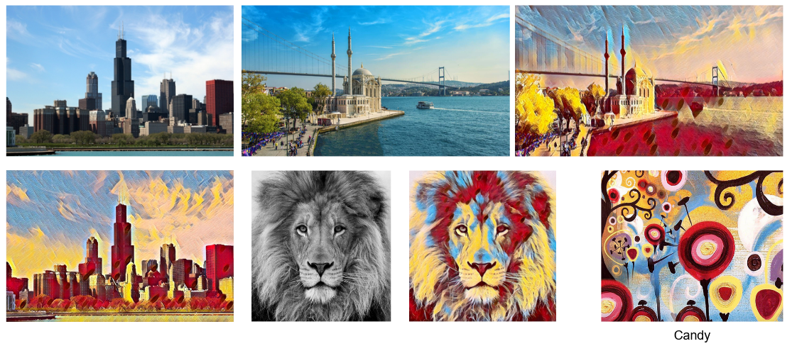
</div>

### 🧊 Crystal Grove
<div align="center">
  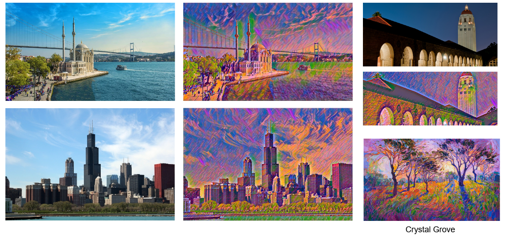
</div>

### 🧩 Mosaic
<div align="center">
  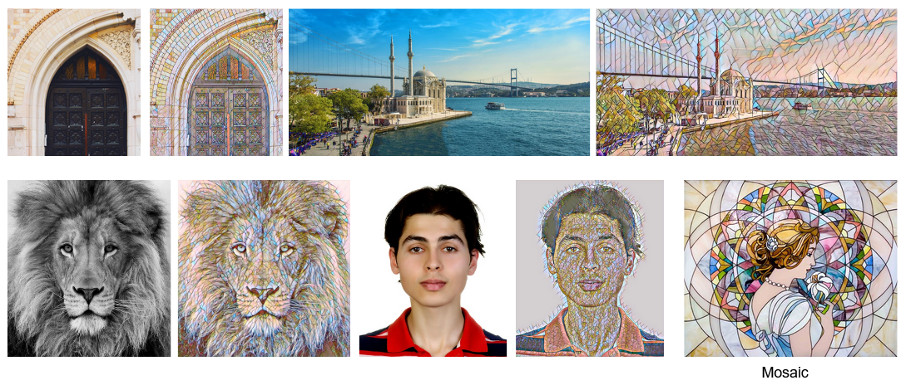
</div>

### 🧝‍♀️ La Muse
<div align="center">
  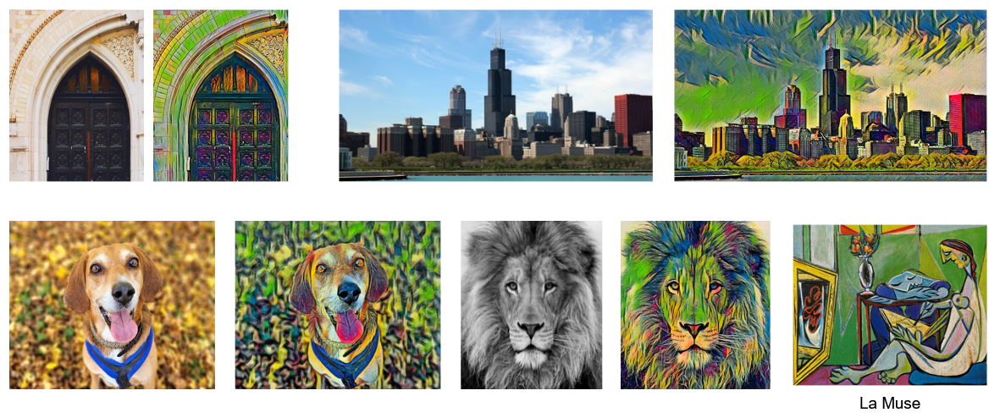
</div>


## 🚀 App

A Gradio web application has been built and deployed on Hugging Face Spaces, allowing users to upload content images and apply stylization using the models trained in this study.

👉 Try it out on the [live application](https://huggingface.co/spaces/ebylmz/fast-neural-style-transfer).

<div align="center">
  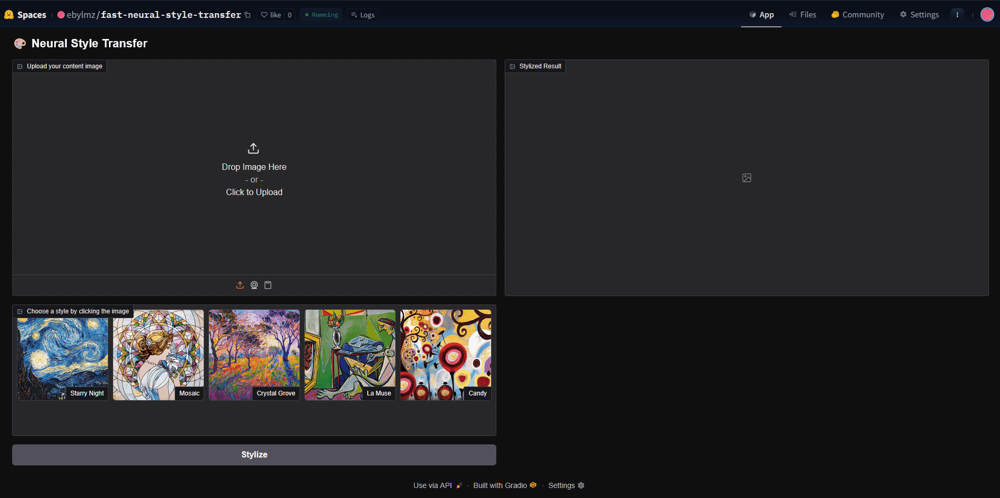
</div>


## 📦 Setup

1. **Clone the repository**

```bash
git clone https://github.com/your-username/fast-neural-style-transfer.git
cd fast-neural-style-transfer
```

2. **Create and activate a Conda environment**
```bash
conda create -n nst python=3.9
conda activate nst
```

3. **Install dependencies**

```bash
pip install -e .
```


## 🧠 Model Architecture / Description 

<div align="center">
    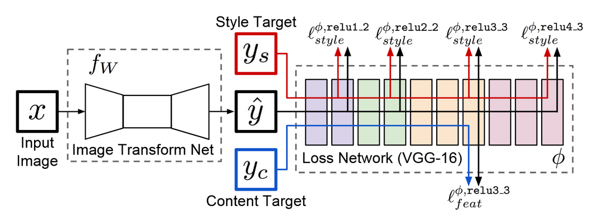
</div>


### 🏗️ Components

- **Transformer Network**
  - Input: RGB content image  
  - Architecture: Convolutional layers with instance normalization and ReLU activations  
  - Residual blocks (ResNet-style) at the core  
  - Upsampling via nearest-neighbor + convolution

- **Perceptual Loss (VGG16-based)**
  - **Content Loss**: Feature reconstruction loss from layer `relu2_2` of VGG16.
  - **Style Loss**: Gram matrix loss across layers `relu1_2`, `relu2_2`, `relu3_3`.
  - **Total Variation Loss**: Regularizer to enforce spatial smoothness and suppress noise.

  The optimization objective: $L_{total}$ = $\lambda_c$ * L_content + $\lambda_s$ * L_style + $\lambda_{tv}$ * L_TV


## 🏋️ Training

The transformation network was trained using the Adam optimizer with a fixed learning rate of $10^{-3}$. A batch size of 4 was used. Normalized images were fed through the network, and perceptual losses were computed with a fixed VGG-16 loss network. The loss was then backpropagated.

Each style model was trained with fixed content and total variation loss weights of $\lambda_c = 2.0$ and $\lambda_{tv} = 2.0$, while the style loss weight $\lambda_s$ was individually tuned for each style in the range of $4 \times 10^5$ to $9 \times 10^5$ to balance stylization strength and content preservation. Training was performed for 1 epoch using the Microsoft COCO dataset on an NVIDIA A100 GPU in a Google Colab environment, requiring approximately an hour per model. In total, five separate models were trained, each corresponding to a unique style of image. For training pipeline and results, you can check the [training notebook](https://colab.research.google.com/drive/1umoj265TKdSOWTwqplEZZF-boubqy45s?usp=sharing). Additionally, trained model weights can be found in project [HuggingFace](https://huggingface.co/spaces/ebylmz/fast-neural-style-transfer/tree/main/models) repository.

Below are the training curves and snapshots for each trained style model:

### 🎇 Starry Night
<div align="center">
  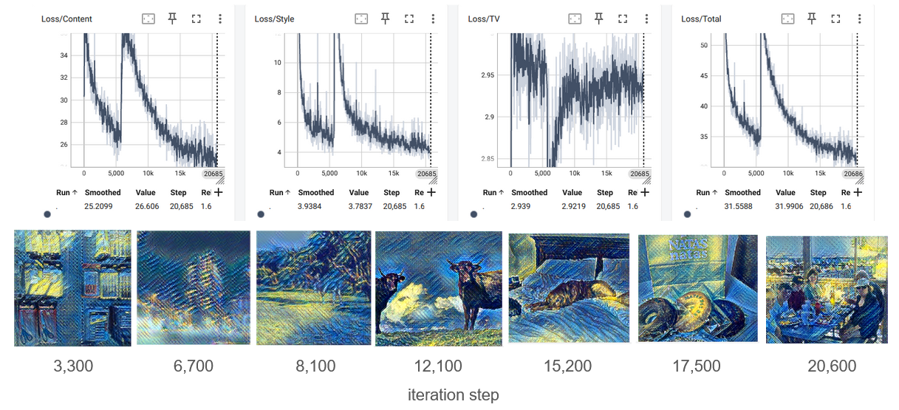
</div>

### 🍬 Candy
<div align="center">
  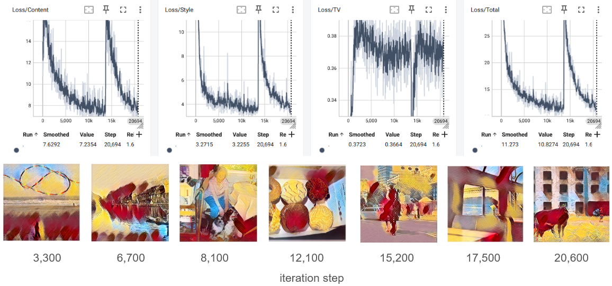
</div>

### 🧊 Crystal Grove
<div align="center">
  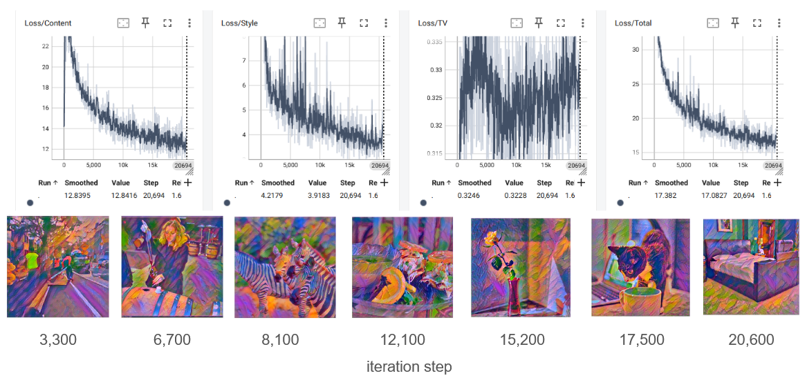
</div>

### 🧩 Mosaic
<div align="center">
  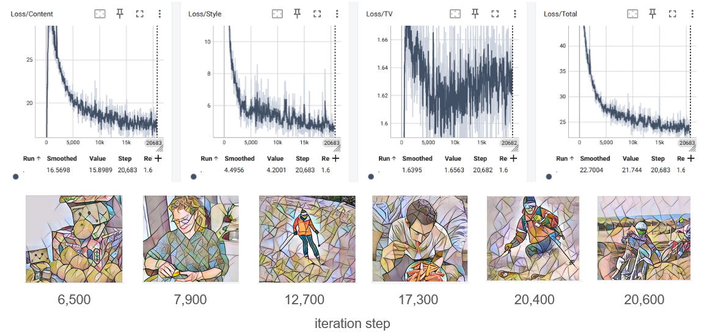
</div>

### 🧝‍♀️ La Muse
<div align="center">
  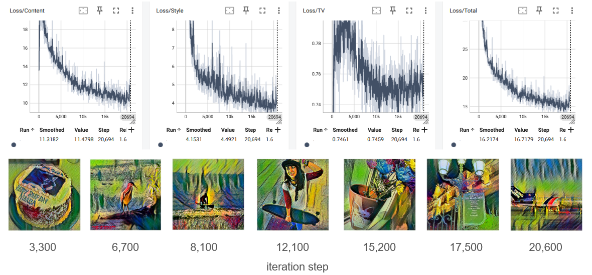
</div>


## 📌 Conclusion

This project demonstrates how fast neural style transfer can be achieved using feedforward convolutional networks trained with perceptual loss functions. By training separate models for different artistic styles, stylized images can be generated in real-time with a single forward pass. 

Through careful tuning of style weights and leveraging high-level VGG features, the models strike a balance between preserving content structure and capturing the aesthetics of the reference artwork.


## 📜 References

[1] [A Neural Algorithm of Artistic Style (Gatys et al., 2015)](https://arxiv.org/abs/1508.06576)

[2] [Perceptual Losses for Real-Time Style Transfer and Super-Resolution (Johnson et al., 2016)](https://arxiv.org/abs/1603.08155)


## ⚖️ License
This project is licensed under the MIT License - see the [LICENSE](LICENSE) file for details.